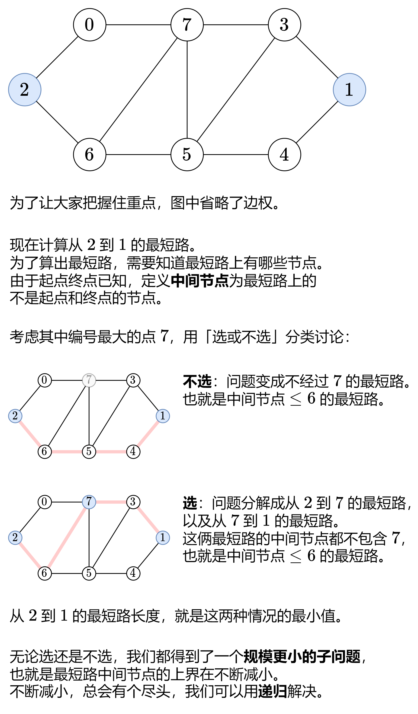

# floyd 算法
> floyd算法用于求 图中两个点之间的最短路径，核心思路是通过状态转移方程，来进行
> 求解


# 思路


# 递归方程
定义 dfs(k,i,j) 表示从 i 到 j 的最短路长度，并且这条最短路的中间节点编号都 <=k。注意中间节点不包含 i 和 j。

根据上面的讨论：

1. 不选 k，那么中间节点的编号都 <=k-1，即 dfs(k,i,j)=dfs(k−1,i,j)。
2. 选 k，问题分解成从 i 到 k 的最短路，以及从 k 到 j 的最短路。由于这两条最短路的中间节点都不包含 k，所以中间节点的编号都 <=k-1，故得到 dfs(k,i,j)=dfs(k−1,i,k)+dfs(k−1,k,j)

这两种情况取最小值，就得到了 dfs(k,i,j)写成式子就是

dfs(k,i,j)=Math.min(dfs(k−1,i,j),dfs(k−1,i,k)+dfs(k−1,k,j))
递归边界：dfs(−1,i,j)=graph[i][j] 
k=−1 表示 i 和 j 之间没有任何中间节点，此时最短路长度只能是连接 i 和 j 的边的边权

递归入口：dfs(n−1,i,j)，表示从 i 到 j 的最短路长度。

递归写法
```java
public class Floyd {
    public int floyd(int[][] graph, int i, int j, int k) {
        if (k < 0) {
            return graph[i][j];
        }
        return Math.min(floyd(graph, i, j, k - 1), floyd(graph, i, k, k - 1) + floyd(graph, k, j, k - 1));
    }
}
```
递归+记忆化写法

```java
public class Floyd {
    //增加一个memory用来记忆
    public int floyd(int[][] graph,int i,int j,int k,int[][][] memory){
        if (k<0){
            return graph[i][j];
        }
        if (memory[i][j][k]>0){
            return memory[i][j][k];
        }
        int min = Math.min(floyd(graph, i, j, k - 1), floyd(graph, i, k, k - 1) + floyd(graph, k, j, k - 1));
        memory[i][j][k]=min;
        return min;
    }
}
```