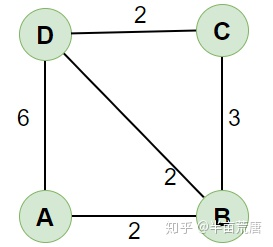
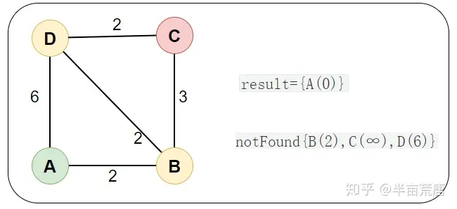
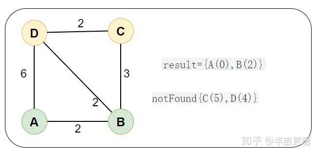
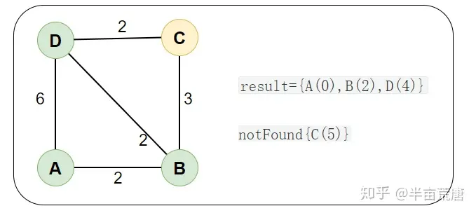
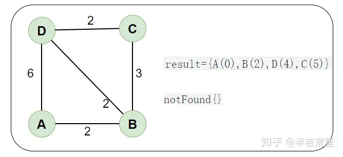

# Dijkstra 算法详解

> Dijkstra 算法是求一个图中一个点到其他所有点的最短路径的算法

### 特点和思路

Dijkstra 算法是一个基于「贪心」、「广度优先搜索」、「动态规划」求一个图中一个点到其他所有点的最短路径的算法，时间复杂度 $O(n2)$

### 要点

每次从 「未求出最短路径的点」中 取出 距离距离起点 最小路径的点，以这个点为桥梁 刷新「未求出最短路径的点」的距离

### 图解分析

**以 A 点为顶点，求到其他点的最短路径。**



邻接矩阵图

int[][] graph = new int[][]{ {0 , 2, ∞, 6} {2 , 0, 3, 2} {∞ , 3, 0, 2} {6 , 2, 2, 0}};

#### 算法要点

1. result：已求出 最小路径的顶点
2. notFound：未求出 最小路径的顶点，里面的值是 到起点的距离 每次从 「未求出最短路径的点」中 取出 距离距离起点 最近的点，以这个点为桥梁 刷新「未求出最短路径的点」的距离

初始，result={A(0)} 中只有起点 A，notFound={B(2),C(∞),D(6)} 中是除了 A 点的其他点，里面的值是到起点的距离（例如 B(2) 代表 B点到起点的距离为 2）



然后，从「未求出最短路径的点」notFound 中取出 最短路径的点 B(2) ，然后通过 B(2) 为桥梁 刷新「未求出最短路径的点」的距离

1. **取出 最短路径的点：**
   从「未求出最短路径的点」notFound 中取出 最短路径的点 B(2)，放入结果 result 中，结果如下：

「未求出最短路径点」 notFound={C(∞),D(6)}，「已求出最短路径的点 」result={A(0),B(2)}

2. **刷新距离：**
   通过 B(2) 为桥梁，刷新距离。

例如 AD = 6 > AB + BD = 4 以 B(2) 为桥梁的距离更短，就刷新「未求出最短路径点」D(6) 的距离为 D(4)

notFound={C(∞),D(4)}

同理刷新 C(∞) 的距离为 C(5) ，最后结果如下：

「未求出最短路径点」 notFound={C(5),D(4)} ，「已求出最短路径的点」`result={A(0),B(2)} `



然后，从「未求出最短路径的点」notFound 中取出 最短路径的点 D(4) ，然后通过 D(4) 为桥梁 刷新「未求出最短路径的点」的距离

同理，最后结果如下：

「未求出最短路径点」 notFound={C(5)} ，「已求出最短路径的点」result={A(0),B(2),D(4)}



然后，从「未求出最短路径的点」notFound 中取出 最短路径的点 C(5) ，算法结束

result={A(0),B(2),D(4),C(5)} 就是最终所求的 最短距离



## 代码

这里使用 -1 表无穷大，下面是 Java 代码和测试案例

```java
public class Dijkstra {
    //graph是 使用二维数组表示的图中节点之间的关联，startVertex是要出发进行查询的点
    public static int[] dijkstra(int[][] graph, int startVertex) {
//初始化 以求出最短路径的点 result[]
        int length = graph.length;
        int[] result = new int[length];
        for (int i = 0; i < length; i++) {
            result[i] = -1;
        }
        result[startVertex] = 0;
// 初始化 未求出最短路径的点 notFound[]
        int[] notFound = new int[length];
        for (int i = 0; i < length; i++) {
            notFound[i] = graph[startVertex][i];
        }
        notFound[startVertex] = -1;
// 开始 Dijkstra 算法
        for (int i = 1; i < length; i++) {
//1. 从「未求出最短路径的点」notFound 中取出 最短路径的点
//1.1 找到最短距离的点
            int min = Integer.MAX_VALUE;
            int minIndex = 0;
            for (int j = 0; j < length; j++) {
                if (notFound[j] > 0 && notFound[j] < min) {
                    min = notFound[j];
                    minIndex = j;
                }
            }
//1.2 将最短距离的点 取出 放入结果中
            result[minIndex] = min;
            notFound[minIndex] = -1;
//2. 刷新 「未求出最短距离的点」 notFound[] 中的距离
//2.1 遍历刚刚找到最短距离的点 (B) 的出度 (BA、BB、BC、BD)
            for (int j = 0; j < length; j++) {
// 出度可通行(例如 BD:graph[1][3]  > 0)
// 出度点不能已经在结果集 result中(例如 D: result[3] == -1)
                if (graph[minIndex][j] > 0
                        && result[j] == -1) {
                    int newDistance = result[minIndex] + graph[minIndex][j];
//通过 B 为桥梁，刷新距离
//（比如`AD = 6 < AB + BD = 4` 就刷新距离）（ -1 代表无限大）
                    if (newDistance < notFound[j] || notFound[j] == -1) {
                        notFound[j] = newDistance;
                    }
                }
            }

        }
        return result;
    }

    /** 测试案例 */
    public static void main(String[] args) {
        char[] vertices = new char[]{'A', 'B', 'C', 'D'};
        int[][] graph = new int[][]{
                {0, 2, -1, 6}
                , {2, 0, 3, 2}
                , {-1, 3, 0, 2}
                , {6, 2, 2, 0}};
        int[] dijkstra = dijkstra(graph, 0);
        for (int i : dijkstra) {
            System.out.println(i);
        }
    }
}
```

测试结果

0 2 5 4